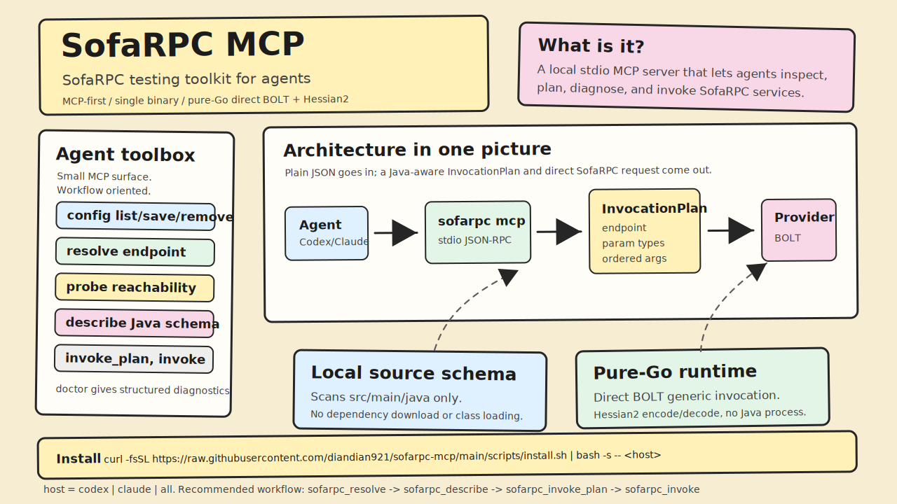

# SofaRPC MCP

[English](README.md) | [简体中文](README.zh-CN.md)



MCP-first SofaRPC testing toolkit for agents.

A single binary `sofarpc` does everything: setup/diagnostic commands (`sofarpc ping`, `sofarpc project`, `sofarpc server`, ...) and the stdio MCP server (`sofarpc mcp`, which is what hosts launch). Invocation runs through a pure-Go direct BOLT/Hessian2 runtime; no Java process or sidecar is required. All invocation is exposed as the `sofarpc_invoke` MCP tool, not a CLI command.

## What Gets Installed

```text
~/.sofarpc/                 (override with SOFARPC_HOME)
  bin/
    sofarpc
  config.json
  cache/
    schema/
```

`config.json` and cache are never overwritten; upgrade just replaces the
binaries at the same canonical path.

## Install

Recommended — one line, install and register with your host(s):

```bash
# macOS / Linux
curl -fsSL https://raw.githubusercontent.com/diandian921/sofarpc-mcp/main/scripts/install.sh | bash -s -- codex     # or claude / all
```

```powershell
# Windows
& ([scriptblock]::Create((iwr -useb https://raw.githubusercontent.com/diandian921/sofarpc-mcp/main/scripts/install.ps1))) codex
```

Pin a release with `--version vX.Y.Z`. Without a host argument it installs
the binary only and prints the next step. `@latest` requires a published
plain `vX.Y.Z` tag on a root-module commit; the bootstrap resolves it via
the GitHub redirect.

<details>
<summary>Alternative: with Go</summary>

```bash
go install github.com/diandian921/sofarpc-mcp/cmd/sofarpc@vX.Y.Z
# call the just-installed binary by absolute path (GOBIN, else GOPATH/bin):
BIN="$(go env GOBIN)"; BIN="${BIN:-$(go env GOPATH)/bin}"
"$BIN/sofarpc" install codex     # or claude / all
```
</details>

<details>
<summary>Alternative: manual release archive (offline)</summary>

```bash
tar -xzf sofarpc-vX.Y.Z-darwin-arm64.tar.gz
cd sofarpc-vX.Y.Z-darwin-arm64
./sofarpc install codex      # or claude / all
```

```powershell
Expand-Archive sofarpc-vX.Y.Z-windows-amd64.zip
cd sofarpc-vX.Y.Z-windows-amd64
.\sofarpc.exe install codex
```
</details>

`sofarpc install <host>` chains the lower-level steps (place the binary at
`~/.sofarpc/bin/sofarpc`, run `sofarpc mcp --selftest`, then register with
the host CLI). Running it again is safe and is the upgrade path.

Build release archives for the full platform matrix:

```bash
./scripts/package.sh
```

Each archive contains the `sofarpc` binary and `README.md`; a single
`SHA256SUMS` file covers all archives. Requirements: Go 1.25+ when building
from source (the MCP layer uses the official `modelcontextprotocol/go-sdk`).

## MCP Configuration

Do not hand-write host config. Register with the host's own CLI via:

```bash
sofarpc setup claude          # or: codex, or: all
sofarpc setup all --dry-run   # preview the exact commands, mutate nothing
```

`setup` registers `command = <root>/bin/sofarpc, args = ["mcp"]` (fully
expanded absolute path, never `~`), propagates `SOFARPC_HOME` only when it
is non-default, and verifies the binary with `sofarpc mcp --selftest` before
touching host config. Re-run
behavior is host-dependent: Codex exposes `mcp get --json` so setup is
exactly idempotent (matching entry → no-op); Claude has no JSON read-back, so
setup is existence-safe — it will not silently overwrite an existing entry and
requires `--force` to replace one.

## MCP Tools

The MCP surface is intentionally small and workflow-oriented:

- `sofarpc_config_list`: list configured projects and servers from `~/.sofarpc/config.json`.
- `sofarpc_config_save_project` / `sofarpc_config_save_server`: add or replace a project/server.
- `sofarpc_config_remove_project` / `sofarpc_config_remove_server`: remove a project/server (requires `confirm=true`).
- `sofarpc_resolve`: resolve the project, server, and endpoint without touching the network.
- `sofarpc_probe`: probe TCP reachability for a configured server or explicit address.
- `sofarpc_describe`: search local Java source or describe a service/method schema.
- `sofarpc_invoke_plan`: resolve and validate an invocation (endpoint, argument types) without sending a request.
- `sofarpc_invoke`: invoke a method over direct BOLT/Hessian2.
- `sofarpc_doctor`: run structured diagnostics for config, source schema, and invoke prerequisites.

The four config-write tools are not registered when the server is started with `--disable-config-write`.

`sofarpc_probe` checks the configured transport path. It does not prove the remote interface, method, or business behavior exists.

`sofarpc_invoke` supports either exact low-level arguments:

```json
{
  "server": "user-test",
  "service": "com.example.UserService",
  "method": "getUser",
  "paramTypes": ["java.lang.String"],
  "orderedArguments": ["u001"]
}
```

or named arguments when local source can resolve the method signature:

```json
{
  "server": "user-test",
  "service": "com.example.UserService",
  "method": "getUser",
  "arguments": {
    "userId": "u001"
  }
}
```

Use `sofarpc_invoke_plan` to inspect the endpoint, parameter types, ordered arguments, and protocol payload without sending a SofaRPC request.

Set `rawResult=true` when debugging serialization or response shape problems. The response then includes both the normal flattened `result` and the decoded Java object shape as `rawResult`.

## Config File

`~/.sofarpc/config.json` is stable and user-editable. The current schema version
is `1`. Older files without `version` are read as version 1; unsupported future
versions are rejected with `CONFIG_UNSUPPORTED_VERSION`.

```json
{
  "version": 1,
  "projects": {
    "user": {
      "workspaceRoot": "/Users/me/workspace/user-service",
      "servicePrefixes": ["com.company.user."]
    }
  },
  "servers": {
    "user-test": {
      "address": "10.0.0.1:12200",
      "project": "user",
      "protocol": "bolt",
      "timeoutMs": 5000,
      "appName": "sofarpc-agent",
      "attachments": {}
    }
  }
}
```

## CLI

Use CLI for setup and diagnostics:

```bash
sofarpc project add user /Users/me/workspace/user-service --prefix com.company.user
sofarpc server add user-test 10.0.0.1:12200 --project user
sofarpc server list --json
```

The `ping` command emits the same structured result contract the MCP tools return. Method invocation is not a CLI command — use the `sofarpc_invoke` MCP tool (or `sofarpc_invoke_plan` for a no-network dry run).

## Local Source Schema

The MCP server parses local Java source only. It does not download Git repos, source jars, Maven dependencies, or load project classes.

Scanned roots:

- `src/main/java`
- `*/src/main/java`

Ignored:

- `src/test/java`
- `target`
- `build`
- `.git`
- `.idea`
- `node_modules`

Schema cache is stored under `~/.sofarpc/cache/schema/` and invalidated by source content fingerprint. Entries unused for 7 days may be cleaned.

## Runtime Boundaries

The pure-Go runtime covers direct BOLT generic invocation and the common Hessian2 value shapes used by DTO-style requests and responses. Declared Java argument and DTO field types are used for numeric encoding, so values such as `Integer`, `Long`, and `Double` do not depend on Go's JSON number shape. The current Java compatibility status is tracked in `docs/compatibility-matrix.md`.

Known limits:

- object reference preservation is not implemented for request encoding; cyclic request values are rejected.
- Go request encoding for `java.util.Date`, enum payloads without source schema, and provider-specific Hessian extensions need more compatibility work before relying on them broadly. Schema-known enum parameters and DTO fields are covered by Hessian oracle tests.
- map keys are flattened to strings in the normal `result`; use `rawResult=true` when key type matters during diagnosis.

## Security Boundaries

`sofarpc mcp` is a local developer tool. Treat stdout as the JSON-RPC protocol stream; diagnostics and future logging must go to stderr. `sofarpc_probe` can dial an explicit address for diagnostics, so prefer configured servers when running against untrusted agent input.

The JSON-RPC protocol layer is the official `modelcontextprotocol/go-sdk` (stdio transport, lifecycle, framing, cancellation). On a handler panic the client receives only a fixed `internal error` message plus an `errorId`; the detail and stack go to stderr under that id.

## MCP Compliance

`sofarpc mcp` negotiates the MCP protocol version at `initialize`, advertising (newest first): `2025-11-25`, `2025-06-18`, `2025-03-26`, `2024-11-05`. An unknown requested version degrades to the newest supported version. Requests before the `initialize` / `notifications/initialized` handshake are rejected with `-32002`.

Declared capabilities: `tools` (static list), `prompts`, `resources`, and `logging` (`notifications/message`). The async tools (`sofarpc_invoke`, `sofarpc_invoke_plan`, `sofarpc_probe`, `sofarpc_describe`, `sofarpc_doctor`) honor `notifications/cancelled` (a cancelled request receives no final response). Of these, `sofarpc_invoke`, `sofarpc_doctor`, and `sofarpc_describe` emit `notifications/progress` when the client supplies a `progressToken` (accepted only as a JSON string or integer).

Every tool declares a per-tool `outputSchema` that describes the shape of its own `data` (not just the shared envelope), and returns its result both as `structuredContent` and as that same JSON serialized into a `text` content block, so a client that does not read structured content still receives the full result. The one-line human summary is carried in `_meta.summary`, alongside `requestId` and `elapsedMs`.

Input and output schemas are advisory host/LLM hints. Argument and business validation run in the handler and surface as the `app.Result` envelope (`isError` plus a recovery `nextTool` / `recovery`), never as a JSON-RPC protocol error; an unknown argument is rejected as an invalid-arguments envelope. `sofarpc_invoke` accepts only the advertised `paramTypes` / `orderedArguments` names — the former `types` / `args` aliases were removed.

The `prompts` capability advertises one user-selected workflow, `sofarpc.invoke_workflow` (the host surfaces it as a slash command or template; it is never auto-executed). Given an `intent` (and optional `server`/`project`/`service`/`method`/`serviceQuery`), it renders the recommended resolve → describe → invoke_plan → invoke path with the failure-recovery contract.

The `resources` capability exposes one read-only resource, `sofarpc://compatibility` — the Java/Hessian2 type support matrix as JSON. The config file itself is deliberately not exposed as a resource because it can carry credential-bearing attachments.

The config-write tools (`sofarpc_config_save_*`) accept `dryRun: true` to validate and preview an entry without writing `config.json`. Attachment values are stored verbatim in the local config (treat them as credentials) and are always redacted in tool/resource output. Start the server with `--disable-config-write` to drop all four config-write tools.

Not supported (intentionally not advertised): `roots`, `sampling`, `elicitation`.

## Troubleshooting

- `CONFIG_INVALID`: fix `~/.sofarpc/config.json`; the tool will not overwrite broken JSON.
- `CONFIG_UNSUPPORTED_VERSION`: the config file was written by a newer unsupported version.
- `CONNECT_FAILED`: check the configured server address and network route.
- `RPC_TIMEOUT`: increase `timeoutMs` or check provider/network latency.
- unresolved external DTO fields: local source parsing cannot see external jar parents. Exact `paramTypes + orderedArguments` remains available.

## Test

The pure-Go suite runs in CI (`.github/workflows/ci.yml`: `go build` + `go vet` +
`go test -race`) and locally from the repo root:

```bash
go test ./...
```

Some tests open loopback ports. In restricted sandboxes, they need permission to bind `127.0.0.1`.

### Real-compatibility oracle (local pre-release gate)

The hand-written Hessian2/BOLT codec is verified against real oracles — a JVM
running the alipay Hessian library, and the official `sofa-bolt-go` library. Run
the gate before cutting a release:

```bash
bash scripts/oracle-gate.sh
```

It runs both oracles and, crucially, treats a **skipped** oracle as a failure: the
Hessian oracle `t.Skip()`s when the JVM or the alipay Hessian jar (`~/.m2`) is
missing, and a skipped Go test still exits 0 — which would fake a pass. The gate
fails loudly instead, so green always means the codec was actually checked.

These suites are excluded from CI (the alipay Hessian jar is an internal artifact
not on public Maven). The underlying commands, if you want to run one directly:

```bash
go test ./internal/direct -tags hessian_oracle   # Go<->Java Hessian contract + golden bytes == real Java
go test ./internal/direct -tags bolt_oracle       # BOLT framing vs official sofa-bolt-go
```

## Design Docs

- [Pure-Go runtime](docs/pure-go-runtime.md)
- [Compatibility matrix](docs/compatibility-matrix.md)
- [Single-binary install target](docs/single-binary-install-target.md)
