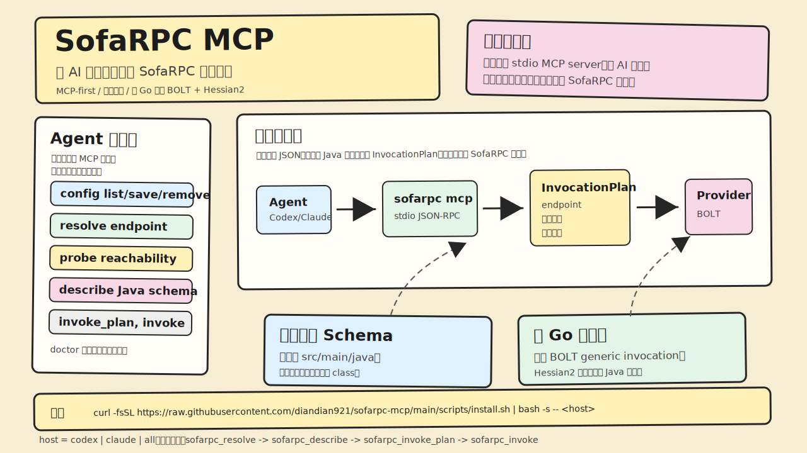

# SofaRPC MCP

[English](README.md) | [简体中文](README.zh-CN.md)



面向 AI 智能体的 MCP-first SofaRPC 测试工具集。

单个 `sofarpc` 二进制完成所有事情：安装/诊断命令（`sofarpc ping`、`sofarpc project`、`sofarpc server` 等）以及 stdio MCP server（`sofarpc mcp`，由 host 启动）。调用路径使用纯 Go 直连 BOLT/Hessian2 运行时，不需要 Java 进程或 sidecar。所有真实调用都通过 `sofarpc_invoke` MCP 工具暴露，不提供 CLI 调用命令。

## 安装后会有什么

```text
~/.sofarpc/                 (可用 SOFARPC_HOME 覆盖)
  bin/
    sofarpc
  config.json
  cache/
    schema/
```

`config.json` 和 cache 永远不会被覆盖；升级只会替换同一标准路径下的二进制文件。

## 安装

推荐方式：一行命令完成安装，并注册到你的 host：

```bash
# macOS / Linux
curl -fsSL https://raw.githubusercontent.com/diandian921/sofarpc-mcp/main/scripts/install.sh | bash -s -- codex     # 或 claude / all
```

```powershell
# Windows
& ([scriptblock]::Create((iwr -useb https://raw.githubusercontent.com/diandian921/sofarpc-mcp/main/scripts/install.ps1))) codex
```

使用 `--version vX.Y.Z` 可以固定版本。如果不传 host 参数，只安装二进制并打印下一步。`@latest` 依赖一个发布在 root module commit 上、格式为普通 `vX.Y.Z` 的 tag；bootstrap 会通过 GitHub redirect 解析它。

<details>
<summary>替代方式：使用 Go</summary>

```bash
go install github.com/diandian921/sofarpc-mcp/cmd/sofarpc@vX.Y.Z
# 使用刚安装好的二进制绝对路径（GOBIN，否则 GOPATH/bin）：
BIN="$(go env GOBIN)"; BIN="${BIN:-$(go env GOPATH)/bin}"
"$BIN/sofarpc" install codex     # 或 claude / all
```
</details>

<details>
<summary>替代方式：手动 release archive（离线）</summary>

```bash
tar -xzf sofarpc-vX.Y.Z-darwin-arm64.tar.gz
cd sofarpc-vX.Y.Z-darwin-arm64
./sofarpc install codex      # 或 claude / all
```

```powershell
Expand-Archive sofarpc-vX.Y.Z-windows-amd64.zip
cd sofarpc-vX.Y.Z-windows-amd64
.\sofarpc.exe install codex
```
</details>

`sofarpc install <host>` 会串起底层步骤：把二进制放到 `~/.sofarpc/bin/sofarpc`，运行 `sofarpc mcp --selftest`，然后注册到 host CLI。重复运行是安全的，也是升级路径。

构建完整平台矩阵的 release archives：

```bash
./scripts/package.sh
```

每个 archive 都包含 `sofarpc` 二进制和 `README.md`；所有 archive 共用一个 `SHA256SUMS` 文件。从源码构建需要 Go 1.25+(MCP 层使用官方 `modelcontextprotocol/go-sdk`)。

## MCP 配置

不要手写 host 配置。通过 host 自己的 CLI 注册：

```bash
sofarpc setup claude          # 或: codex, 或: all
sofarpc setup all --dry-run   # 预览准确命令，不修改任何内容
```

`setup` 注册的是 `command = <root>/bin/sofarpc, args = ["mcp"]`（完全展开的绝对路径，绝不使用 `~`）。只有在 `SOFARPC_HOME` 非默认值时才会传递它，并且在修改 host 配置前会用 `sofarpc mcp --selftest` 验证二进制。

重复运行的行为取决于 host：Codex 提供 `mcp get --json`，因此 setup 是精确幂等的（已有匹配 entry 就 no-op）；Claude 没有 JSON read-back，所以 setup 只保证存在性安全，不会静默覆盖已有 entry，必须传 `--force` 才能替换。

## MCP 工具

MCP 暴露面刻意保持小而面向工作流：

- `sofarpc_config_list`：从 `~/.sofarpc/config.json` 列出已配置项目和 server。
- `sofarpc_config_save_project` / `sofarpc_config_save_server`：新增或替换 project/server。
- `sofarpc_config_remove_project` / `sofarpc_config_remove_server`：删除 project/server（需要 `confirm=true`）。
- `sofarpc_resolve`：解析 project、server 和 endpoint，不访问网络。
- `sofarpc_probe`：探测已配置 server 或显式地址的 TCP 可达性。
- `sofarpc_describe`：搜索本地 Java 源码，或描述 service/method schema。
- `sofarpc_invoke_plan`：解析并校验一次调用（endpoint、参数类型），不发送请求。
- `sofarpc_invoke`：通过 direct BOLT/Hessian2 调用方法。
- `sofarpc_doctor`：对 config、source schema 和 invoke 前置条件运行结构化诊断。

当 server 以 `--disable-config-write` 启动时，四个写配置工具不会注册。

`sofarpc_probe` 只检查已配置的传输路径。它不能证明远端 interface、method 或业务行为一定存在。

`sofarpc_invoke` 支持精确的底层参数：

```json
{
  "server": "user-test",
  "service": "com.example.UserService",
  "method": "getUser",
  "paramTypes": ["java.lang.String"],
  "orderedArguments": ["u001"]
}
```

当本地源码可以解析 method signature 时，也支持命名参数：

```json
{
  "server": "user-test",
  "service": "com.example.UserService",
  "method": "getUser",
  "arguments": {
    "userId": "u001"
  }
}
```

使用 `sofarpc_invoke_plan` 可以在不发送 SofaRPC 请求的情况下检查 endpoint、参数类型、有序参数和协议 payload。

调试序列化或响应结构问题时设置 `rawResult=true`。响应中会同时包含常规扁平化的 `result`，以及解码后的 Java object 结构 `rawResult`。

## 配置文件

`~/.sofarpc/config.json` 是稳定且用户可编辑的。当前 schema version 是 `1`。没有 `version` 的旧文件会按 version 1 读取；不支持的未来版本会以 `CONFIG_UNSUPPORTED_VERSION` 拒绝。

```json
{
  "version": 1,
  "projects": {
    "user": {
      "workspaceRoot": "/Users/me/workspace/user-service",
      "servicePrefixes": ["com.company.user."]
    }
  },
  "servers": {
    "user-test": {
      "address": "10.0.0.1:12200",
      "project": "user",
      "protocol": "bolt",
      "timeoutMs": 5000,
      "appName": "sofarpc-agent",
      "attachments": {}
    }
  }
}
```

## CLI

CLI 用于 setup 和诊断：

```bash
sofarpc project add user /Users/me/workspace/user-service --prefix com.company.user
sofarpc server add user-test 10.0.0.1:12200 --project user
sofarpc server list --json
```

`ping` 命令会输出和 MCP 工具相同的结构化 result contract。方法调用不是 CLI 命令，请使用 `sofarpc_invoke` MCP 工具（或用 `sofarpc_invoke_plan` 做无网络 dry run）。

## 本地源码 Schema

MCP server 只解析本地 Java 源码。它不会下载 Git repo、source jar、Maven 依赖，也不会加载项目 class。

扫描根目录：

- `src/main/java`
- `*/src/main/java`

忽略：

- `src/test/java`
- `target`
- `build`
- `.git`
- `.idea`
- `node_modules`

Schema cache 存储在 `~/.sofarpc/cache/schema/` 下，并通过源码内容 fingerprint 失效。超过 7 天未使用的 entry 可能被清理。

## 运行时边界

纯 Go 运行时覆盖 direct BOLT generic invocation，以及 DTO 风格请求/响应常用的 Hessian2 value shapes。声明的 Java 参数类型和 DTO field 类型会用于数值编码，因此 `Integer`、`Long`、`Double` 这类值不依赖 Go JSON number 的形态。当前 Java 兼容性状态见 `docs/compatibility-matrix.md`。

已知限制：

- 请求编码尚未实现 object reference preservation；循环 request value 会被拒绝。
- `java.util.Date`、缺少 source schema 的 enum payload，以及 provider-specific Hessian extensions 的 Go 请求编码，在广泛依赖前还需要更多兼容性工作。Schema 已知的 enum 参数和 DTO field 已覆盖 Hessian oracle tests。
- 常规 `result` 中 map keys 会扁平化为字符串；诊断时如果 key 类型很重要，请使用 `rawResult=true`。

## 安全边界

`sofarpc mcp` 是本地开发工具。把 stdout 视为 JSON-RPC 协议流；诊断和未来日志必须写入 stderr。`sofarpc_probe` 可以为诊断拨打显式地址，因此面对不可信的 agent input 时，优先使用已配置 server。

JSON-RPC 协议层使用官方 `modelcontextprotocol/go-sdk`(stdio 传输、生命周期、分帧、取消)。handler panic 时,client 只会收到固定的 `internal error` 信息和 `errorId`;详细信息和 stack 会以该 id 写入 stderr。

## MCP 兼容性

`sofarpc mcp` 在 `initialize` 阶段协商 MCP protocol version，按新到旧声明：`2025-11-25`、`2025-06-18`、`2025-03-26`、`2024-11-05`。未知请求版本会降级到最新支持版本。在 `initialize` / `notifications/initialized` 握手前的请求会以 `-32002` 拒绝。

声明的 capabilities：`tools`（静态列表）、`prompts`、`resources` 和 `logging`（`notifications/message`）。异步工具（`sofarpc_invoke`、`sofarpc_invoke_plan`、`sofarpc_probe`、`sofarpc_describe`、`sofarpc_doctor`）支持 `notifications/cancelled`（被取消的请求不会返回最终响应）。其中 `sofarpc_invoke`、`sofarpc_doctor` 和 `sofarpc_describe` 会在 client 提供 `progressToken` 时发出 `notifications/progress`（只接受 JSON string 或 integer）。

每个工具声明**各自的** `outputSchema`，描述其 `data` 的真实结构（而非仅统一信封），并把结果同时作为 `structuredContent` 和序列化进 `text` content block 返回。input/output schema 是面向 host/LLM 的提示：参数与业务校验在 handler 中完成，并以 `app.Result` 信封（`isError` + 恢复用 `nextTool` / `recovery`）返回，绝不退化成 JSON-RPC protocol error；未知参数会以 invalid-arguments 信封拒绝。`sofarpc_invoke` 只接受声明的 `paramTypes` / `orderedArguments`（原 `types` / `args` 别名已移除）。

`prompts` capability 声明了一个用户可选的工作流 `sofarpc.invoke_workflow`（host 把它作为 slash command 或模板展示，**绝不自动执行**）。给定 `intent`（以及可选的 `server`/`project`/`service`/`method`/`serviceQuery`），它渲染出推荐的 resolve → describe → invoke_plan → invoke 流程和失败恢复契约。

`resources` capability 暴露一个只读 resource `sofarpc://compatibility` —— Java/Hessian2 类型支持矩阵(JSON)。config 文件本身有意**不**作为 resource 暴露,因为它可能带凭据 attachments。

写配置工具(`sofarpc_config_save_*`)支持 `dryRun: true`:校验并预览条目,但不写 `config.json`。attachment 的值原样存进本地 config(请按凭据对待),在工具 / resource 输出里始终脱敏。用 `--disable-config-write` 启动可去掉这四个写配置工具。

不支持（也有意不声明）：`roots`、`sampling`、`elicitation`。

## 故障排查

- `CONFIG_INVALID`：修复 `~/.sofarpc/config.json`；工具不会覆盖损坏的 JSON。
- `CONFIG_UNSUPPORTED_VERSION`：config 文件由较新的不受支持版本写入。
- `CONNECT_FAILED`：检查已配置 server 地址和网络路由。
- `RPC_TIMEOUT`：增大 `timeoutMs`，或检查 provider/network latency。
- unresolved external DTO fields：本地源码解析看不到外部 jar parent。仍可使用精确的 `paramTypes + orderedArguments`。

## 测试

纯 Go 测试套件会在 CI 中运行（`.github/workflows/ci.yml`：`go build` + `go vet` + `go test -race`），也可以在 repo root 本地运行：

```bash
go test ./...
```

部分测试会打开 loopback ports。在受限沙箱中，它们需要绑定 `127.0.0.1` 的权限。

### 真实兼容性 oracle（本地 pre-release gate）

手写 Hessian2/BOLT codec 会用真实 oracle 校验：一个运行 alipay Hessian library 的 JVM，以及官方 `sofa-bolt-go` library。发布前运行 gate：

```bash
bash scripts/oracle-gate.sh
```

它会运行两个 oracle，并且关键点是：把 **skipped** oracle 当成失败处理。Hessian oracle 在 JVM 或 alipay Hessian jar（`~/.m2`）缺失时会 `t.Skip()`，而被 skip 的 Go test 仍会 exit 0，这会造成假通过。gate 会明确失败，所以绿色结果一定表示 codec 真的被检查过。

这些 suites 不进入 CI（alipay Hessian jar 是内部 artifact，不在 public Maven）。如果想直接运行底层命令：

```bash
go test ./internal/direct -tags hessian_oracle   # Go<->Java Hessian contract + golden bytes == real Java
go test ./internal/direct -tags bolt_oracle       # BOLT framing vs official sofa-bolt-go
```

## 设计文档

- [Pure-Go runtime](docs/pure-go-runtime.md)
- [Compatibility matrix](docs/compatibility-matrix.md)
- [Single-binary install target](docs/single-binary-install-target.md)
